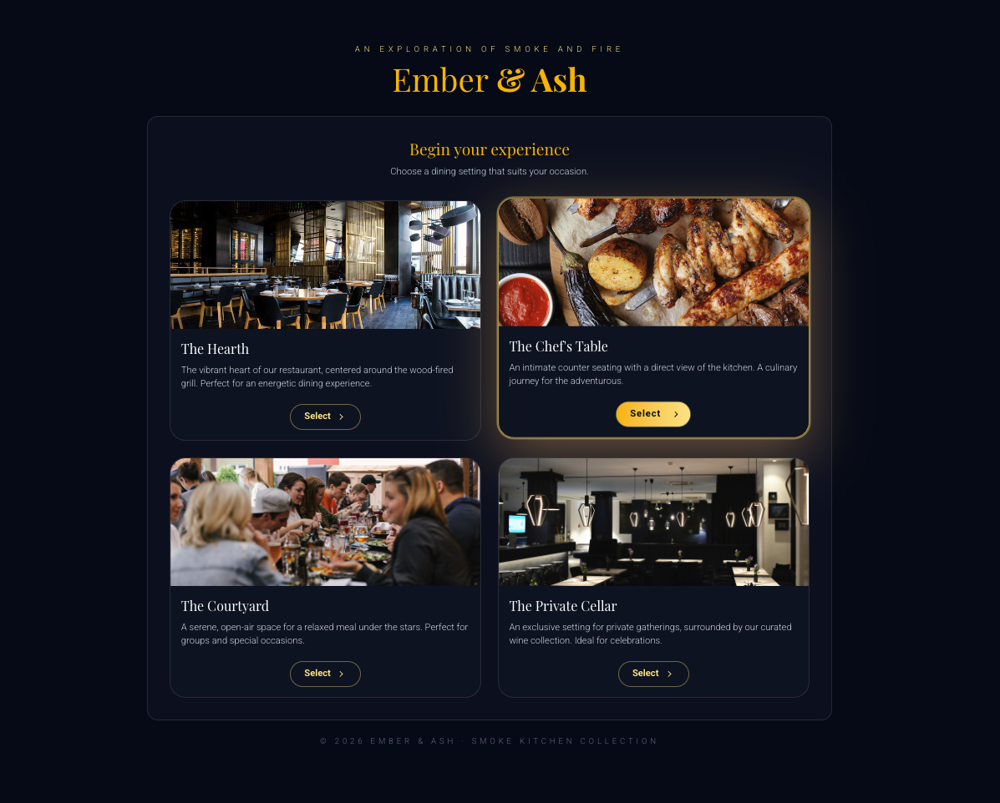

# Ember & Ash - Restaurant Booking

A multi-step restaurant table booking app with experience selection, availability lookup, and booking confirmation. Dark UI with amber accents and frosted glass effects.

**[Live Demo](https://psandis.github.io/restaurant-booking/)**



## Features

- **Experience Selection** - Choose from four dining settings: The Hearth, The Chef's Table, The Courtyard, and The Private Cellar
- **Smart Availability** - Find available time slots based on party size, date, and preferred time
- **Multi-Step Booking Flow** - Guided wizard from experience selection through to confirmation
- **Guest Controls** - Stepper input for party size (1-20 guests)
- **Dark Theme** - Slate/amber palette with backdrop blur and frosted glass cards

## Booking Flow

```
Experience Selection → Details (guests, date, time) → Available Times → Contact Details → Confirmation
```

Each step animates in with transitions. The back button returns to the previous step without losing state.

## Project Structure

```
booking-restaurant/
├── src/
│   ├── app/
│   │   ├── layout.tsx          # Root layout, fonts (Playfair Display, Roboto)
│   │   ├── page.tsx            # Main page, all booking step components
│   │   └── globals.css         # Tailwind imports, custom styles
│   ├── components/
│   │   └── icons.tsx           # SVG icon components (Calendar, Clock, Spinner, etc.)
│   ├── services/
│   │   └── geminiService.ts    # Availability lookup (simulated, AI-ready placeholder)
│   └── types/
│       └── booking.ts          # BookingStep enum, BookingDetails, UserDetails interfaces
├── public/
│   └── images/tables/          # Experience photos (hearth, courtyard, cellar, chef's table)
├── package.json
├── tsconfig.json
├── next.config.ts
├── postcss.config.mjs
└── eslint.config.mjs
```

## Tech Stack

| Component | Technology | Version |
|-----------|-----------|---------|
| Framework | Next.js | 16.0.1 |
| UI | React | 19.2.0 |
| Language | TypeScript | 5 |
| Styling | Tailwind CSS | 4 |
| Utilities | clsx | 2.1.1 |
| Icons | lucide-react | 0.553.0 |

## Quick Start

```bash
git clone https://github.com/psandis/restaurant-booking.git
cd restaurant-booking
npm install
npm run dev
```

Open http://localhost:3021.

## Build

```bash
npm run build
npm start
```

## License

[MIT](LICENSE)
